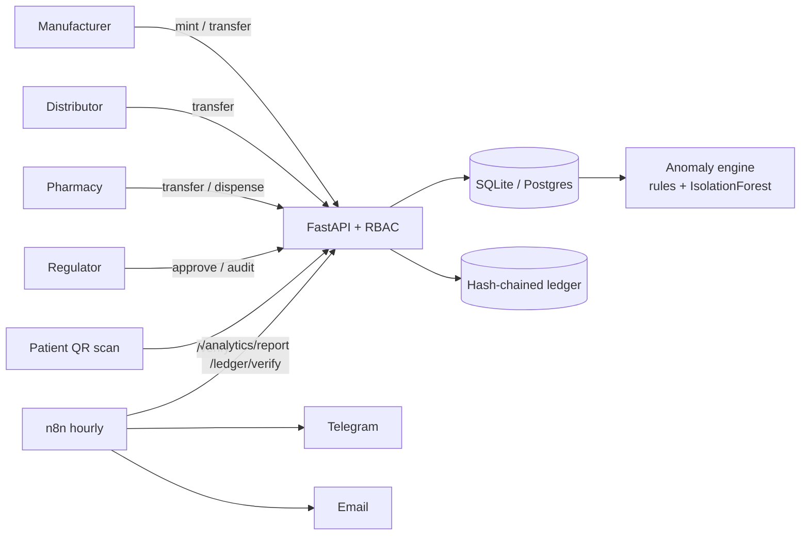

# 💊 PharmaTrace

**Tamper-evident pharmaceutical traceability + ML counterfeit detection + n8n alerting.**

   

Counterfeit medicines are a $200B+ problem. PharmaTrace tracks every box from manufacturer → distributor → pharmacy → patient,
stores every custody event in a **hash-chained ledger** (any edit or deletion is detectable), and runs **rule-based + IsolationForest**
detection on public QR scans to catch cloned serials, resellers, and counterfeit batches in the wild. Alerts go to regulators via **n8n** (Telegram + email).

> Built as a reference MVP for the *"Medical Supply Chain Management & Pharmaceutical Traceability Platform"* brief.

---

## ✨ Features

| Area | What it does |
|---|---|
| **Traceability** | GS1-style IDs (GTIN check digit + random serial), drug registration, regulator approval, unit minting, custody transfer, dispensing |
| **Audit ledger** | Append-only SHA-256 hash chain; `verify()` pinpoints the exact row that was modified, deleted, or reordered |
| **Public verification** | `GET /verify/{uid}` for patients: authentic / unknown (counterfeit) / already dispensed / expired |
| **Security** | PBKDF2 (600k iter), HMAC-signed expiring tokens, deny-by-default RBAC, object-level ownership checks (anti-IDOR), parameterized SQL, security headers, non-root read-only container |
| **Data science** | Impossible-travel, scan-burst, counterfeit-cluster rules + IsolationForest on per-serial behavioural features |
| **Automation** | n8n workflow: hourly anomaly report + ledger integrity check → Telegram / email |
| **DevSecOps** | GitHub Actions: ruff, pytest, bandit (SAST), pip-audit (SCA) |

## 🏗 Architecture



## 🚀 Quick start

```bash
git clone https://github.com/<you>/pharmatrace && cd pharmatrace
python -m venv .venv && source .venv/bin/activate
pip install -r requirements-dev.txt
pytest -q                               # 24 tests: core, security, ML
uvicorn pharmatrace.api.main:app --reload   # docs at http://localhost:8000/docs
```

**Docker (API + n8n):**
```bash
cp .env.example .env    # set PHARMATRACE_SECRET
docker compose up --build
# n8n: http://localhost:5678 -> Import -> n8n/counterfeit_alert_workflow.json
```

**Data science demo:**
```bash
python scripts/generate_synthetic_data.py --out data/scans.csv
python scripts/run_analysis.py
```
Sample output on 2,000 units / 5,336 scans with injected fraud (25 cloned, 15 burst, 40 fake serials):
```
 rule_flags: {'impossible_travel': 18, 'scan_burst': 15}
 unknown_clusters: [{'cell': '25.2,55.3', 'unknown_scans': 34}, ...]
 recall: 1.0   precision: 0.667
```

## 🔐 Security model

See [`docs/THREAT_MODEL.md`](docs/THREAT_MODEL.md). Every control has a regression test in [`tests/test_security.py`](tests/test_security.py):

| OWASP API 2023 | Test |
|---|---|
| API1 BOLA / IDOR | can't transfer a unit you don't hold; rival can't mint on your GTIN |
| API2 Broken auth | forged role, wrong key, expired, malformed tokens rejected |
| API5 Function-level auth | pharmacy can't approve drugs; manufacturer can't read audit |
| Injection | classic SQLi payloads on public endpoint are inert |
| Integrity | modified / deleted ledger rows detected at exact `seq` |

## 📡 API

| Method | Path | Role |
|---|---|---|
| POST | `/auth/signup`, `/auth/login` | public (regulators provisioned out-of-band) |
| POST | `/drugs` | manufacturer |
| POST | `/drugs/{gtin}/approve` | regulator |
| POST | `/units` | owning manufacturer |
| POST | `/units/{uid}/transfer` | current custodian |
| POST | `/units/{uid}/dispense` | pharmacy custodian |
| GET | `/units/{uid}/history` | regulator |
| GET | `/verify/{uid}` | **public** |
| GET | `/ledger/verify`, `/analytics/report` | regulator |

## 🗺 Roadmap
- [ ] PostgreSQL + Alembic migrations, row-level security
- [ ] Rate limiting on `/verify` (anti-enumeration)
- [ ] Merkle-root anchoring of the ledger to a public timestamping service
- [ ] React dashboard for regulators (map of counterfeit clusters)
- [ ] EPCIS 2.0 event export

## 📁 Structure
```
pharmatrace/
  core/        security.py  identifiers.py  ledger.py  service.py
  analytics/   anomaly.py
  api/         main.py
n8n/           counterfeit_alert_workflow.json
scripts/       generate_synthetic_data.py  run_analysis.py
tests/         test_core.py  test_security.py  test_anomaly.py
docs/          THREAT_MODEL.md  PROPOSAL_FA.md
```

## License
MIT
